<h1 align="center">Hi, I'm Rounak Sen 👋🏿</h1>

  
<strong>M.Tech in AR/VR at IIT Jodhpur | AI Researcher</strong>

  
  

   

  [**Portfolio**](https://rounak-sen.vercel.app/) • [**Research Paper**](https://proceedings.scipy.org/articles/XHDR4700) • [**LinkedIn**](https://www.linkedin.com/in/rounak-sen/)

 

# 📖 About Me

- 🎓 **M.Tech Student** in **Augmented & Virtual Reality** at **IIT Jodhpur** (2025-2027).
- 🦀 **Software Engineer** focused on **Rust** and **AI**, with experience in web scraping frameworks and AI detection systems.
- 📜 **Researcher**: Published work on **Mamba Models** at **SciPy 2024**.
- 🏆 **GATE Qualifier**: **AIR 418** in Data Science & AI (2025).
- 🧩 **Coder**: Solved **800+ LeetCode problems** with a consistent daily streak.

 

# 🚀 Featured Projects

- 🦀 **[BitTorrent-Rs](https://github.com/rony0000013/BitTorrent-Rs)**: A multithreaded BitTorrent Protocol implementation in Rust with magnet link support.
- ⚡ **[ZigShell](https://github.com/rony0000013/zig-shell)**: A POSIX-compliant shell developed in Zig, featuring process management and piping.
- 🎨 **[MangaIRO](https://github.com/rony0000013/MangaIRO)**: High-performance GAN-based model for automatic manga colorization using PyTorch.
- 🐹 **[RedisGo](https://github.com/rony0000013/redis-go)**: A concurrent Redis-compatible in-memory database implemented in Go.
- 📈 **[Unveil](https://github.com/rony00000013/Unveil)**: AI-powered stock learning platform integrating Gemini API and real-time market data.
- 🧪 **[ArxivQ&Allm](https://github.com/rony0000013/arxiv-qa-llm-app)**: A RAG-based application for intelligent research paper analysis using Pathway and Gemini.

 

# 🛠️ Tech Stack

### Languages & Logic

  
  
  
  
  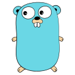
  
  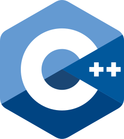
  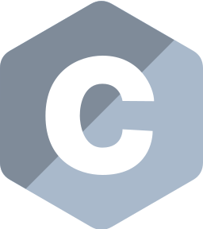
  
  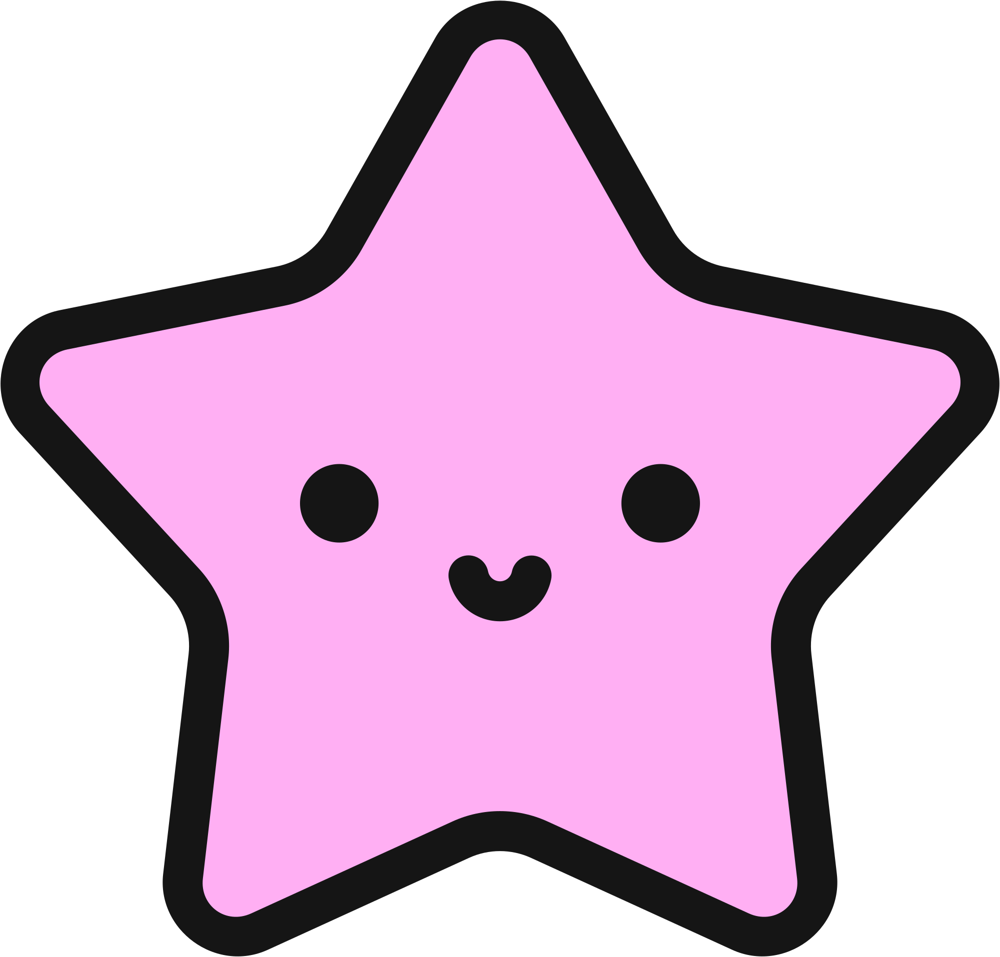
  
  
  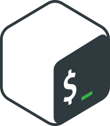

### Neural Networks & AI

  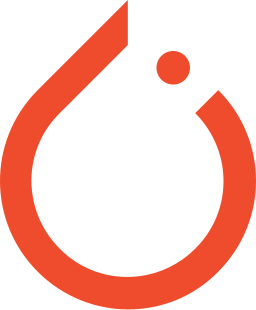
  
  
  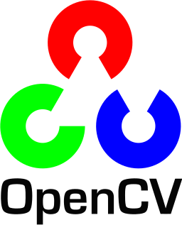
  
  
  
  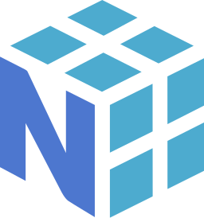
  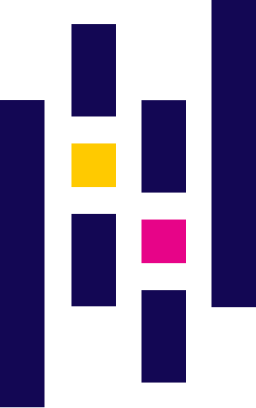
  
  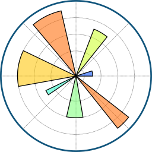
  
  
  
  
  
  
  
  
  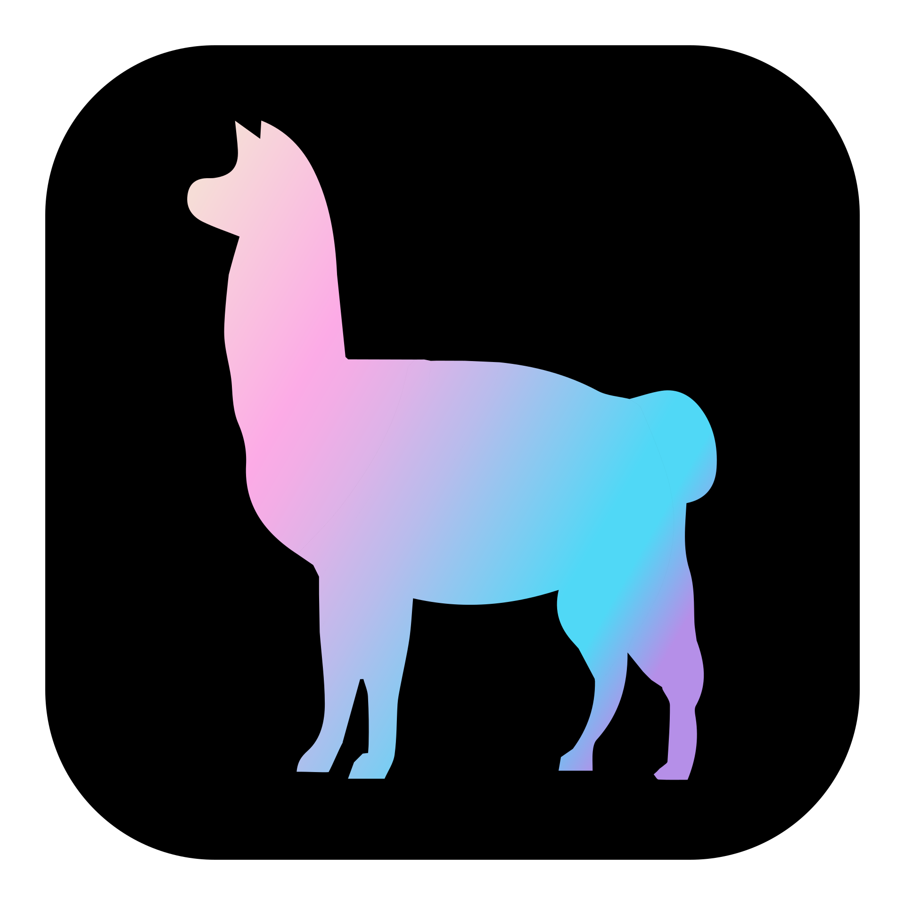
  
  
  
  
  
  
  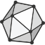

### Core Systems (Backend)

  
  
  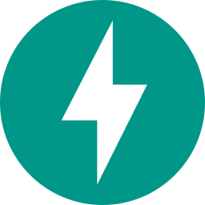
  
  
  
  
  
  
  
  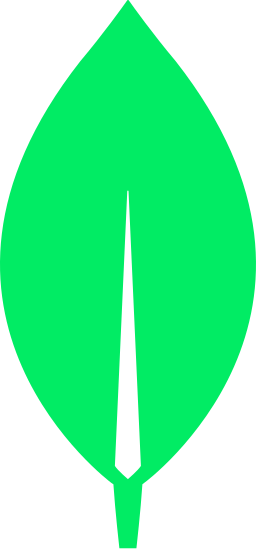
  
  
  
  
  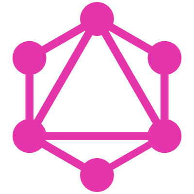
  
  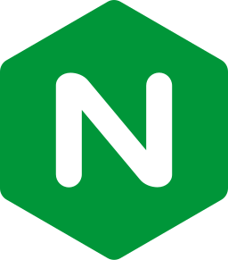
  
  
  
  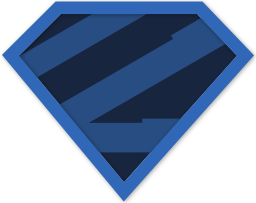
  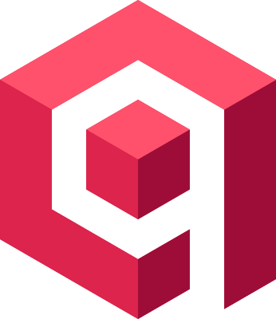
  
  
  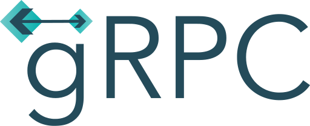
  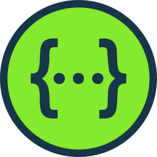
  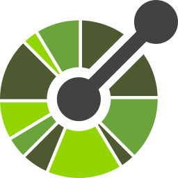
  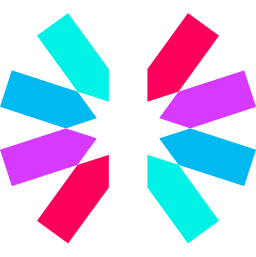
  
  

### Neural Interface (Frontend)

  
  
  
  
  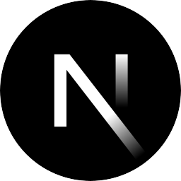
  
  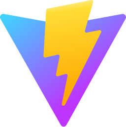
  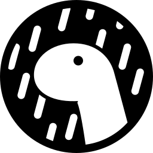
  
  
  
  
  
  
  

### Universal Tools

  
  
  
  
  
  
  
  
  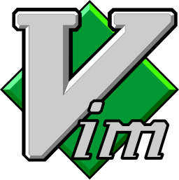
  
  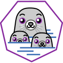
  
  
  
  
  
  
  
  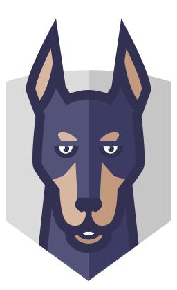
  

### Web3

  
  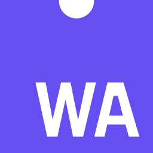
  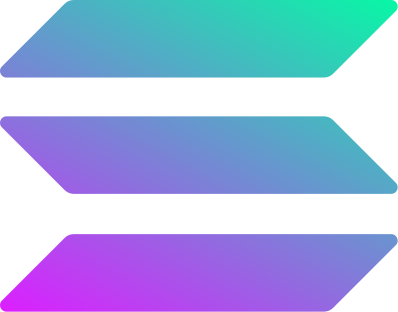
  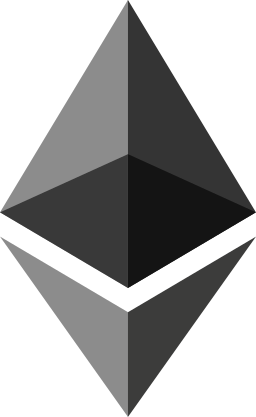
  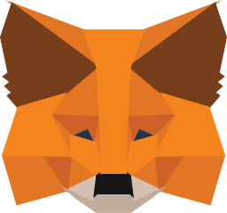

 

# 📊 GitHub Stats

  
  

  
  

 

# 🎧 Spotify Activity

  

 

# 👨‍💻 Programming Humor

  

 

  
  
<i>Based in Kolkata, India 🇮🇳</i>

